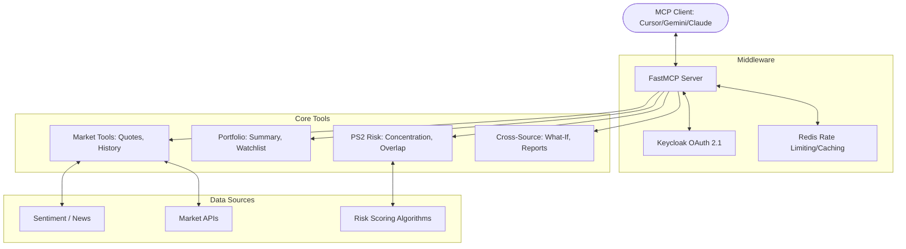

# StockSonar: Intelligent Market & Portfolio Risk MCP Server

StockSonar is a powerful **Model Context Protocol (MCP)** server providing real-time Indian market data, portfolio risk analytics (PS2), and sentiment analysis. It features tiered access control via Keycloak and high-performance caching via Redis.

## 🏗️ Architecture



## ✨ Key Features

- **🔌 Universal MCP Compatibility**: Connects seamlessly with Gemini CLI, Cursor, Claude Code, and any other MCP-compatible environment.
- **🛡️ Enterprise Auth**: Tiered access (Free, Premium, Analyst) managed via **Keycloak OAuth 2.1** and JWT scopes.
- **📊 Advanced PS2 Risk Analysis**: Sophisticated tools for detecting concentration risk, mutual fund overlap, and macro sensitivity.
- **🌍 Real-Time Intelligence**: Combines live stock quotes with GNews-driven sentiment analysis.
- **🔮 "What-If" Analysis**: Simulates the impact of macro events (e.g., RBI rate cuts, sector shifts) on your specific portfolio.
- **⚡ High Performance**: Implements Redis-based sliding window rate-limiting and persistent caching for expensive tool calls.
- **📝 Structured Responses**: Every tool returns rich JSON with clear sources, disclaimers, and timestamps.

## 🛠️ Things Supported

- **Market Data**: Stock quotes, price history, index performance (NSE/BSE).
- **Portfolio Management**: Multi-user portfolios, watchlists, and holdings tracking.
- **Risk Metrics**: 
  - **Concentration**: Sector/Stock weightage analysis.
  - **Overlaps**: Detecting hidden similarities in mutual fund holdings.
  - **Macro**: Sensitivity to interest rates, inflation, and global trends.
- **Resources**: `market://overview`, `macro://snapshot`, `portfolio://{user}/risk_score`.
- **Prompts**: `morning_risk_brief`, `rebalance_suggestions`, `earnings_exposure`.

## 🚀 Getting Started

### Prerequisites
- Docker & Docker Compose
- Python 3.11+

### Quick Start (Docker)
```bash
docker compose up -d --build
```
*Wait ~60s for Keycloak to initialize.*

### Using with Gemini CLI
1. Switch to static-token mode:
   ```bash
   docker compose --env-file .env.llm up -d --build mcp-server
   ```
2. Run Gemini:
   ```bash
   gemini
   ```

## 🧪 Testing & Demos
- **Judge Demo**: `python scripts/run_judge_demo.py` (Full Analyst story).
- **Interactive Shell**: `python scripts/ps2_interactive.py`.
- **Health Check**: `python scripts/check_stack_health.py`.

---
*Deep market insights at your fingertips.*
